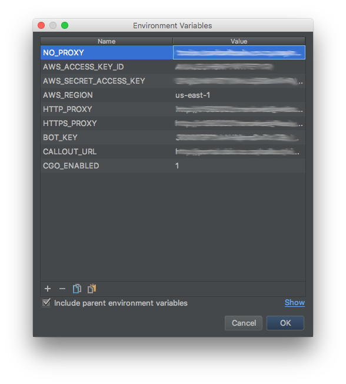

# go2hal

## Description
GO 2 Hal is a devops automation telegram bot which automates a number of repetitive tasks, while also providing the team with insight into your systems.

The bot consists of a number of individual models, so if you want to create your own bot, its as simple as creating your main.go and choosing the modules.

the main.go provided here uses all the modules, wrapped in gokit proetheus instrumenting and gokit logging.

Refer to the readme.md for each Module

## Getting Started
Install a mongo DB locally. By Default, HAL will look for a mongo database on localhost.

Run the HAL executable

Below is an example of the Environment variables I have setup on GoLand. The only one thats really important is the BOT_KEY, the rest are used within the submodules of HAL. Reffer to each sub modules README.md for more details.

## Modules

### Telegram Service

Provides a service to send telegram messages and images to groups

### Alert Service

Extends upon the Telegram Service to abstract the taget group of a message. Currently provides for 3 groups

* Business Group - A group to send non technical messages
* Alert Group - For the technical people
* Heartbeat Group - for the bot admins

### Appdynamics

Allows App Dyanmics to send alert messages
Monitor MQ Queues via App Dynamics
Execute commands based on App Dynamics Alerts

### Callout

Invoke Callout by quering a web app to see who is on callout
sends SNMP traps
creates JIRA tickets

### Chef

Alows Chef Delivery to send Alerts
Get Nodes based upon recipe and environment

### Database

Mongo Database capability

### gokit

Some common gokit wrappers

### halSelenium

a wrapper to make writting of selenium tests easier

### http

monitor http endpoints and alert when the endpoints fail

### jira

create JIRA tickets

### kubernetes

Sample files to deploy the bot in kubernetes

### Remote Telegram Commands

allows a remote program to register a telegram command, for example "/someCommand", on the bot. When the command is executed
a grpc call is made back to the system that requetsed the command.

### Selenium Tests

periodically execute the selenium tests and alert on error

### Sensu

Handle sensu alerts

### skynet

an internal module to rebuild nodes

### snmp

Send SNMP alerts

### SSH

execute SSH commands on a remote server
fetch data via SFTP

